# 🏛️ Maze Game — Asterix & Obelix in the Labyrinth


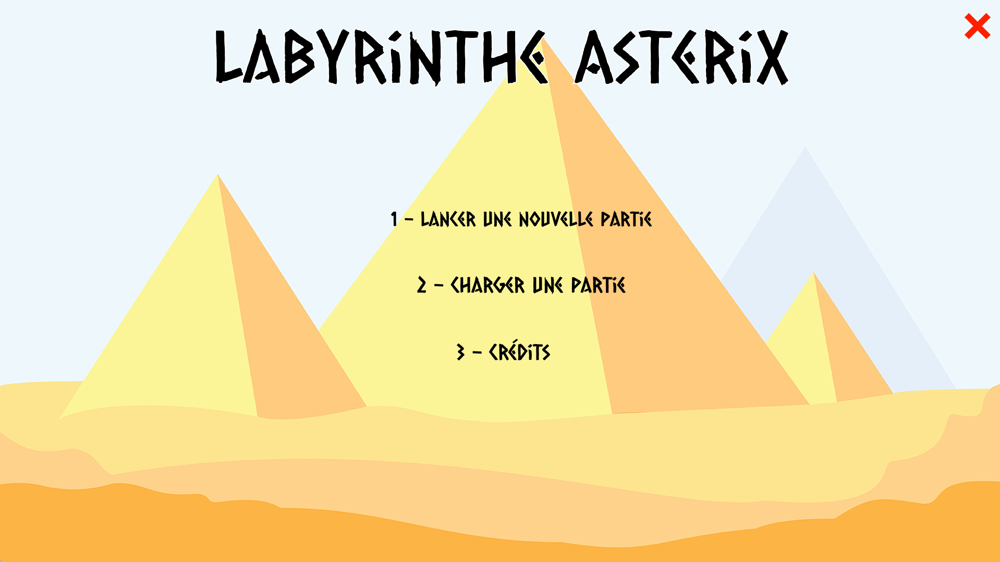

---

## 📝 Project Description

> *Asterix, Obelix, Panoramix and Idefix are trapped inside the pyramid labyrinth by **Tournevis**, the henchman of **Amonbofis**, rival of our friend the architect **Numerobis**.*
>
> *After locking them in, his voice echoes through the stone:*
> **"This tomb shall be your tomb"**
>
> *The 4 players must now race through the maze — collecting all their treasures to escape.*
>
> *Who will be the fastest? Your turn...*

<details>
<summary>🇫🇷 French version</summary>

<br>

> *Astérix, Obélix, Panoramix et Idéfix sont coincés dans le labyrinthe de la pyramide par **Tournevis**, le sbire d'**Amonbofis**, le concurrent de notre ami l'architecte **Numérobis**.*
>
> *Après les avoir enfermés, sa voix résonne :*
> **"Ce tombeau sera votre tombeau"**
>
> *Les 4 joueurs vont donc s'élancer dans une course folle : récupérer tous les trésors pour pouvoir sortir.*
>
> *Qui sera le plus rapide ? À vous de jouer...*

</details>

<br>

A **2–4 player board game** coded from scratch in **C** using the **Allegro 5** library, built as a school project at ECE Paris (2022–2023).
Inspired by the classic Ravensburger *Labyrinth* board game, but set in the Asterix & Obelix universe — Asterix, Obelix, Panoramix and Idefix are trapped in the pyramid labyrinth by Tournevis.
Each player must slide tiles, navigate the maze, and collect all their treasures before returning to their starting corner.
The one who collects all their treasures and returns to base first **wins**!

> ⏳ This project was built back in **2022–2023** — a little while ago now 😄 The original version had several bugs that have since been fixed.

<details>
<summary>🐛 Bugs fixed (compared to the original 2022–2023 version)</summary>

<br>

- **DPI scaling — dual screen:** On a dual-monitor setup, only the top-left portion of the game was visible because Windows was silently scaling the Allegro window without DPI awareness. Fixed by dynamically loading `SetProcessDPIAware` via `GetProcAddress` before `al_init()`.
- **DPI scaling — hitbox offset:** On a single screen with Windows display scaling (e.g. 125 %/150 %), mouse click coordinates were reported in logical pixels while the game rendered in physical pixels — causing all button hitboxes to be offset. Same DPI fix resolved this.
- **No victory message:** The original victory screen showed a generic "Win" image with no indication of *who* won. Added a text overlay displaying **"Joueur X a gagné !"** in gold.

</details>

---

## ⚙️ Features

  🗺️ **7×7 sliding tile board** — push rows and columns to reshape the labyrinth each turn

  🏺 **24 unique treasures** to collect, distributed equally between players (themed around Asterix & Obelix: shield, menhir, cauldron, magic potion...)

  👥 **2 to 4 players** on the same keyboard, each with their own pawn and treasure list

  🧭 **Pathfinding algorithm** — validates each move, no cheating through walls

  💾 **Save & load system** — up to 10 save slots, auto-saved every turn

  🎨 **Full graphical UI** — custom menus, animated tile rotation, player info panel, victory screen

  🪟 **DPI-aware rendering** — correct scaling and hitboxes on both single and dual-screen setups

---

## Example Outputs

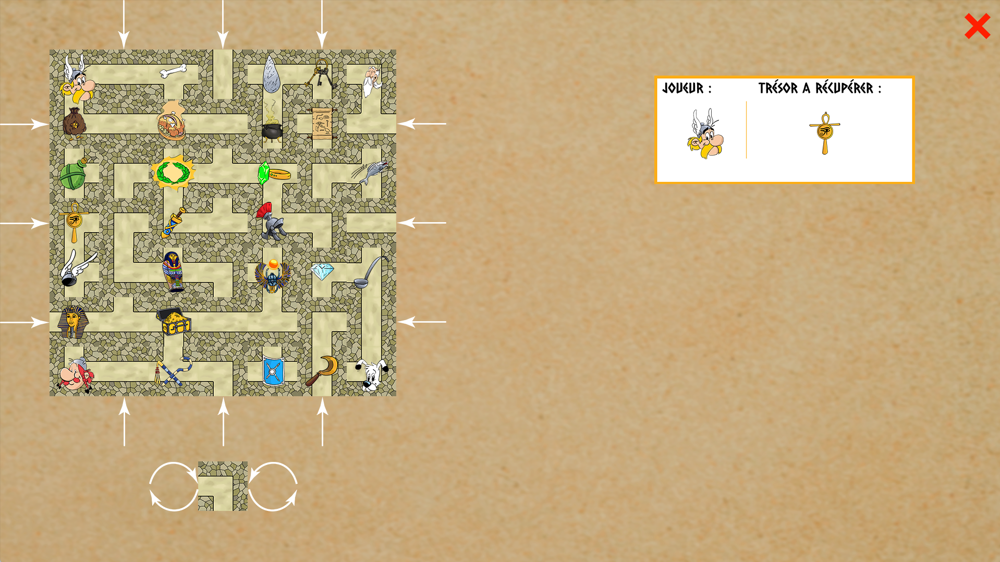

The game board shows the 7×7 labyrinth with sliding arrows on each side.
Players navigate by clicking a tile to move to it (if reachable), and use the arrows to push an entire row or column before moving.
The extra piece rotates with dedicated buttons.

### Player pawns

| Asterix | Obelix | Panoramix | Idefix |
|---------|--------|-----------|--------|
| 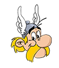 |  |  |  |

### Treasure objects

| | | | | |
|---|---|---|---|---|
| 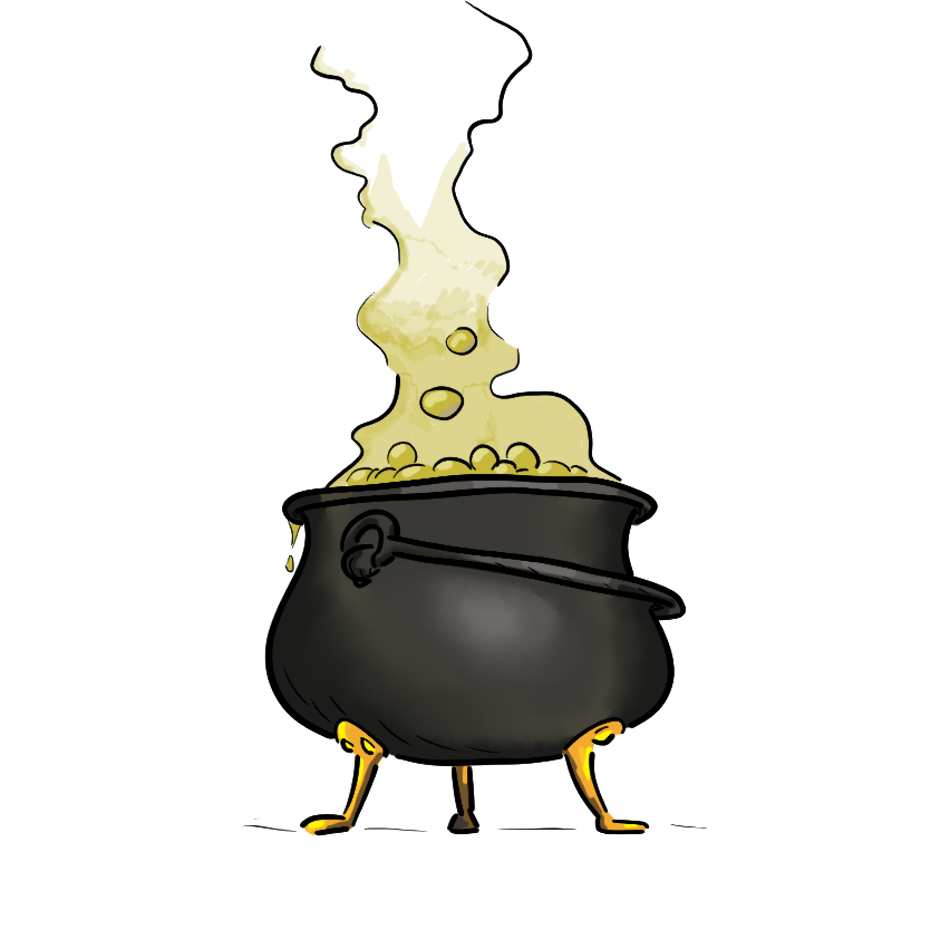 Cauldron | 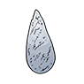 Menhir |  Sickle | 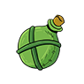 Gourd |  Bone |
| 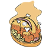 Boar |  Fish |  Pharaoh | 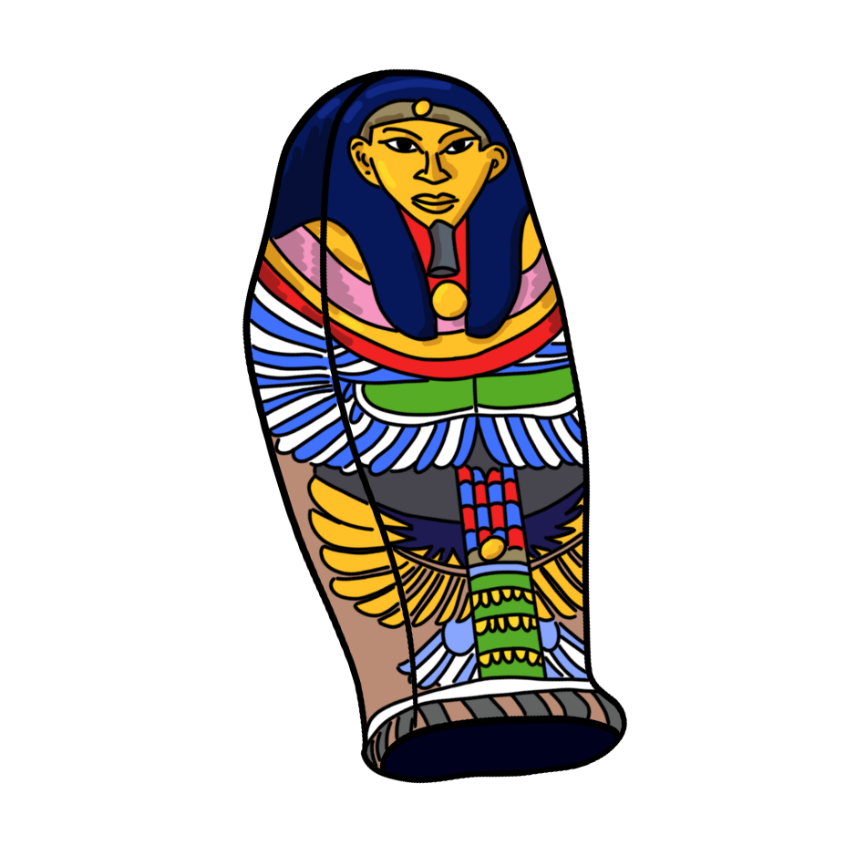 Sarcophagus | 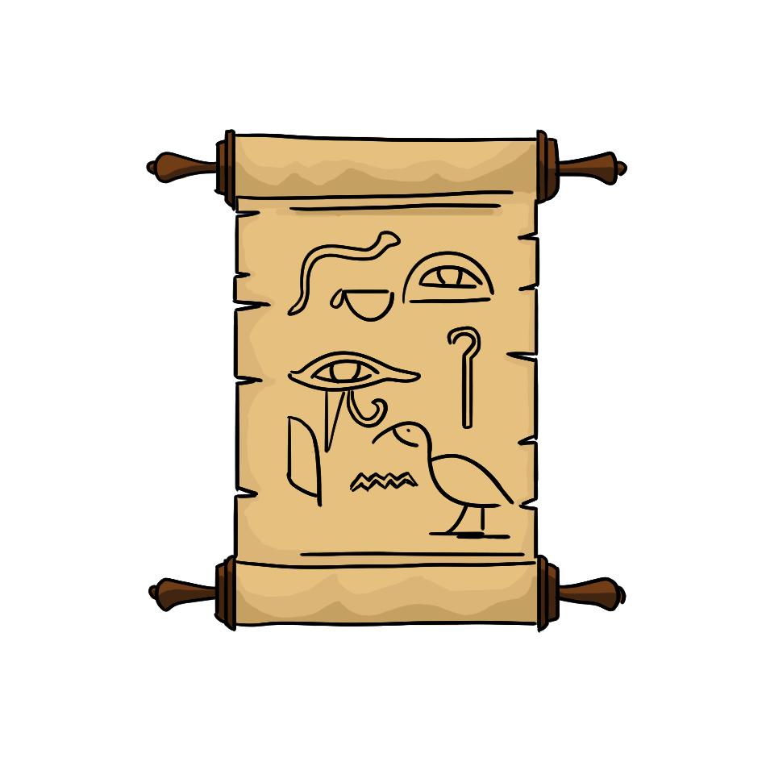 Papyrus |
|  Emerald ring | 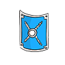 Shield | 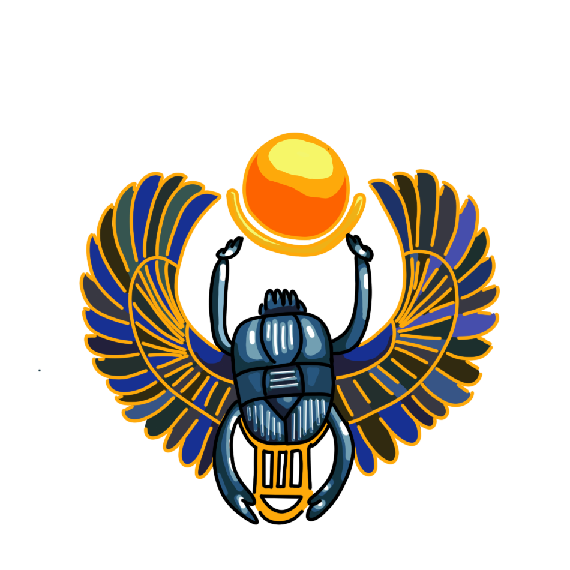 Jewels |  Helmet | 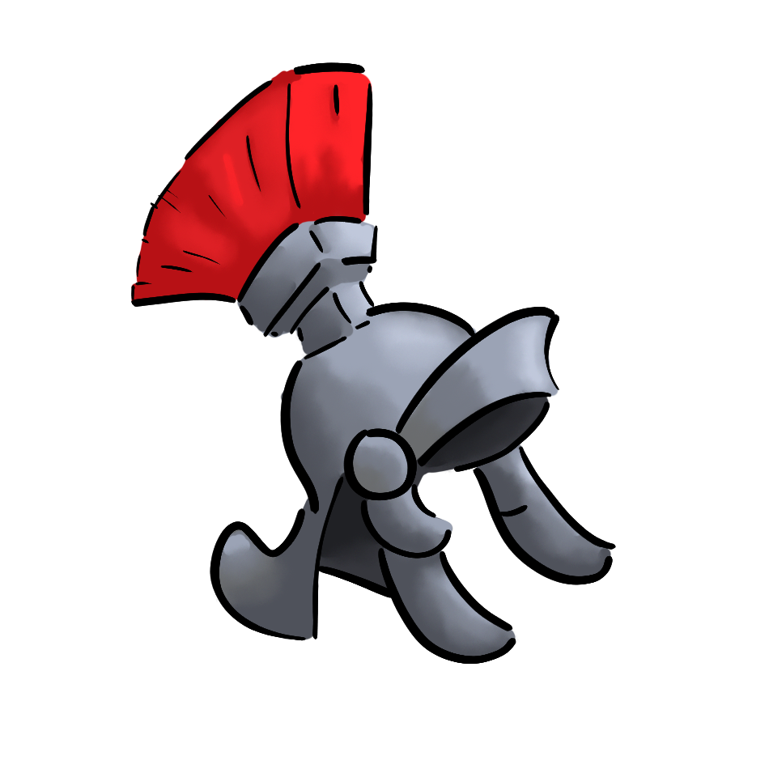 Roman helmet |
|  Key | 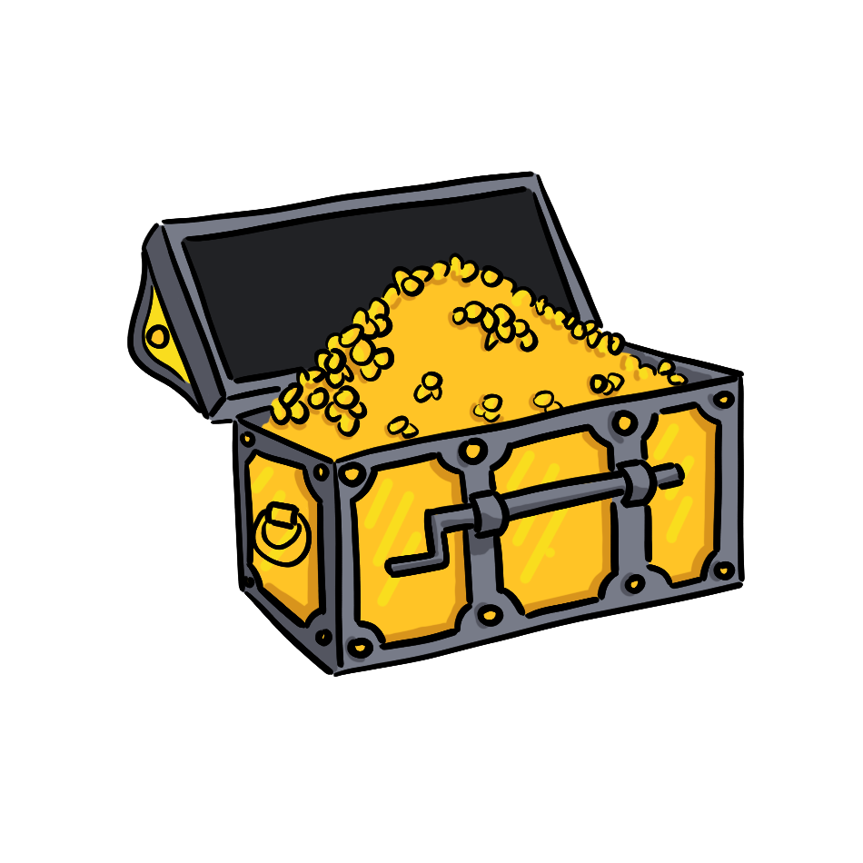 Chest |  Laurel crown |  Diamond | 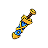 Sword |
| 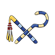 Whip | 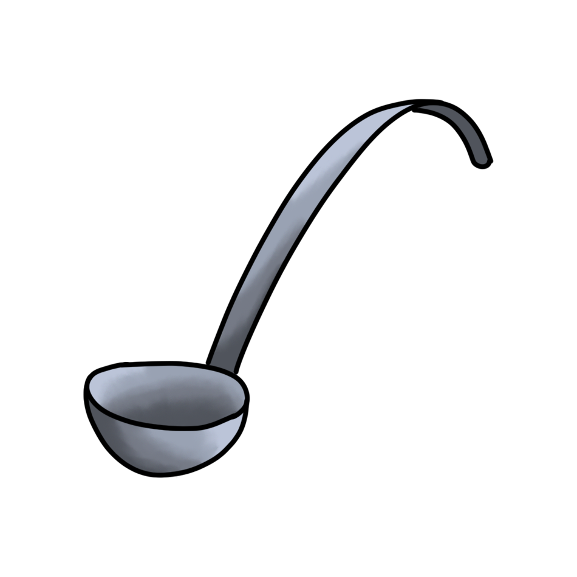 Ladle |  Eye | 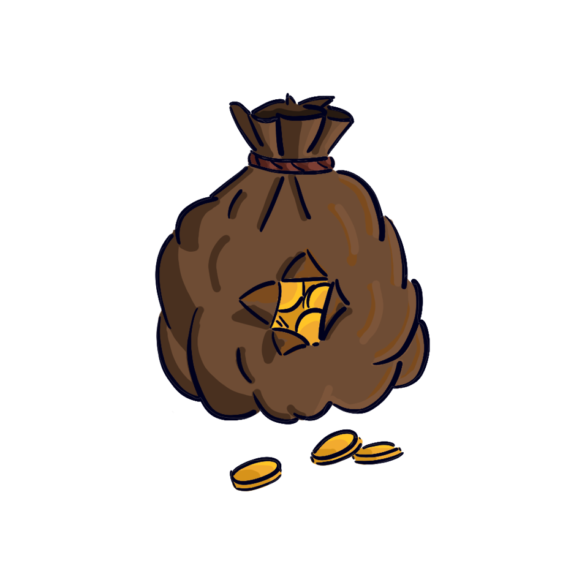 Coin purse | 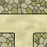 Labyrinth tile |

---

## ⚙️ How it works

  🎲 At the start of each turn, the current player **pushes a row or column** by clicking an arrow button — the extra tile enters from one side and the last tile exits on the other.

  🔄 The extra piece can be **rotated** before insertion using the two rotation buttons.

  🖱️ The player then **clicks a tile** on the board to move their pawn to it — the pathfinding engine checks if a valid corridor path exists between the current and target position.

  🏺 If the player lands on their **current target treasure**, it is collected and the next one becomes the objective.

  🏠 Once all treasures are collected, the player must **return to their starting corner** to win.

  💾 After each full turn, the **game state is saved** automatically to a save slot.

---

## 🗺️ Schema

### Board Layout

```text
[↓] [↓] [↓]          ← push buttons (columns, top)
[→] [ maze 7×7 ] [←] ← push buttons (rows, left/right)
[↑] [↑] [↑]          ← push buttons (columns, bottom)

Extra piece: shown separately with rotation buttons (↺ ↻)
```

### Player starting corners

```text
P3 ─────────── P4
│               │
│   7×7 board  │
│               │
P1 ─────────── P2
```

---

## 📂 Repository structure

```bash
├── ALLEGRO/
│   ├── .c/                         # All source files
│   │   ├── main.c                  # Game loop, menu flow, victory
│   │   ├── Gc.c                    # Allegro wrapper (display, sprites, buttons)
│   │   ├── Party.c                 # Game state, turn management
│   │   ├── Plateau.c               # Board logic, tile sliding
│   │   ├── Player.c                # Player movement, treasure check
│   │   ├── Part.c                  # Individual tile structure
│   │   ├── PathFinding.c           # BFS pathfinding for movement validation
│   │   ├── Menu.c                  # All UI menus and button logic
│   │   ├── Button.c                # Button component wrapper
│   │   ├── SaveManager.c           # Save/load game state
│   │   └── utils.c
│   │
│   └── .h/                         # All header files
│
├── Import/                         # All assets (sprites, fonts, UI images)
│   ├── tuile_*.png                 # 50 unique labyrinth tile sprites
│   ├── Dessin_*.png                # Treasure sprites & player pawns
│   ├── Menu_FHD_ALLEGRO.png        # Main menu background
│   └── *.ttf                       # Custom fonts (CaesarDressing, BruceForever...)
│
├── CPL.bat                         # Build script (Windows / MinGW)
├── SAVE_0 … SAVE_4                 # Save files
├── a.exe                           # Compiled executable
└── README.md
```

---

## 💻 Run it on Your PC

### Requirements

- **Windows** with **MinGW** installed at `C:\MinGW`
- **Allegro 5.0.10** libraries in `C:\MinGW\lib` and headers in `C:\MinGW\include`

### Build & Run

```bash
git clone https://github.com/Thibault-GAREL/Game_maze_Asterix-Obelix.git
cd Game_maze_Asterix-Obelix
```

Then simply double-click `CPL.bat`, or run it from a terminal:

```bash
.\CPL.bat
```

This compiles all sources and launches `a.exe` automatically.

```bash
./a.exe
```

> 💡 If the project is already compiled, you can also just double-click **`a.exe`** directly to launch the game without recompiling.

### Manual compile command

```bash
gcc -g -Wall -IC:\MinGW\include -LC:\MinGW\lib \
  ALLEGRO/.c/PathFinding.c ALLEGRO/.c/SaveManager.c ALLEGRO/.c/Button.c \
  ALLEGRO/.c/fonction_t.c ALLEGRO/.c/Gc.c ALLEGRO/.c/main.c \
  ALLEGRO/.c/Menu.c ALLEGRO/.c/Part.c ALLEGRO/.c/Party.c \
  ALLEGRO/.c/Plateau.c ALLEGRO/.c/Player.c ALLEGRO/.c/utils.c \
  -lallegro-5.0.10-mt -lallegro_font-5.0.10-mt \
  -lallegro_image-5.0.10-mt -lallegro_ttf-5.0.10-mt \
  -luser32 -o a.exe
```

⚠️ The `Import/` folder must be in the **same directory as `a.exe`** for assets to load correctly.

---

## 📖 Inspiration / Sources

Team:

- 🎨 [Robin KOENIG](https://github.com/RobinKoenig69)
- ⚙️ [Matthieu GROS](https://github.com/MatthieuGROS)
- 🎮 [Antoine](https://github.com/Antoine31G)
- 🖥️ [Thibault GAREL](https://github.com/Thibault-GAREL)

Code created by the team and me 😎, Thibault GAREL - [Github](https://github.com/Thibault-GAREL)
